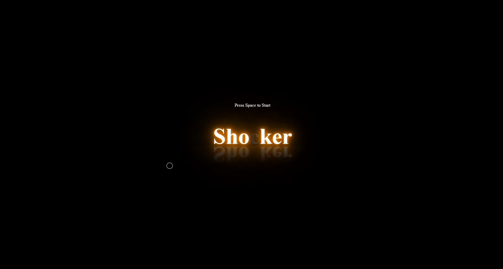
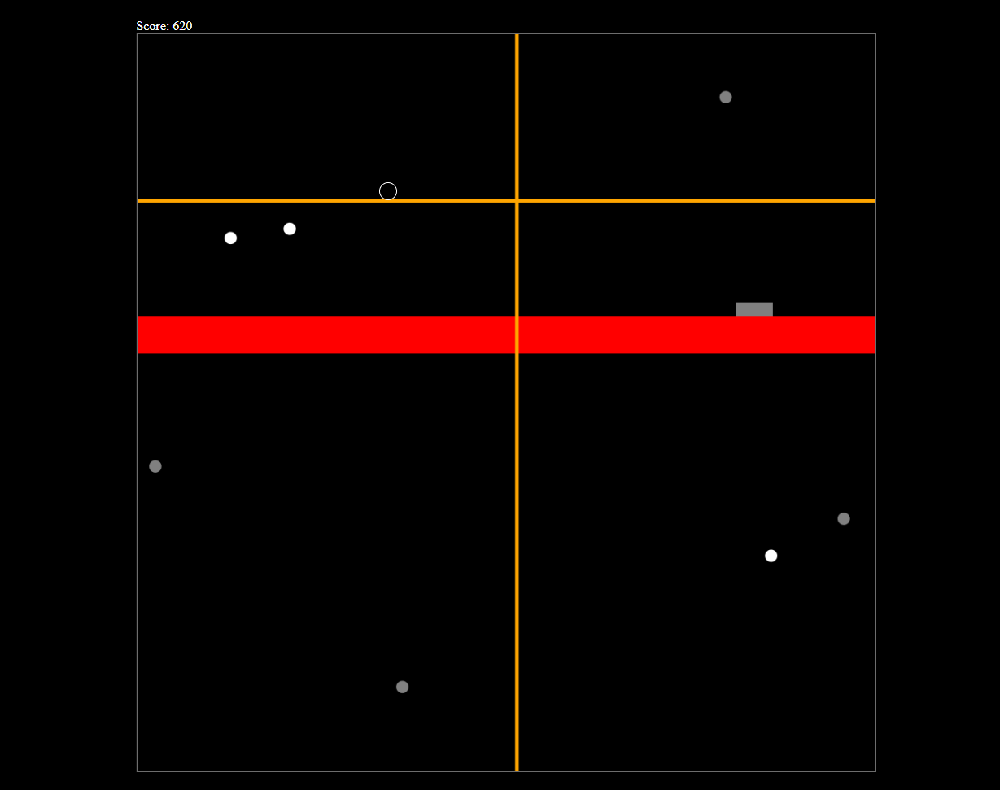

# Shocker Game

## An original(I think...) arcade game created where you survive and collect points for as long as possible.

This project was made for the MLH hackathon: 'Hack-Cade 2'

## How to run application

1. Play now at [https://nokeen12.github.io/Shocker-Game/](https://nokeen12.github.io/Shocker-Game/)

or

1. Clone this project
2. Open live server and visit `http://127.0.0.1:5500/client/index.html`

### Tech

JavaScript, HTML, CSS

## About

Shocker, the game were you avoid getting shocked!

Use WASD or Arrow Keys to move around and collect points while dodging the random lasers that are out to get you.
